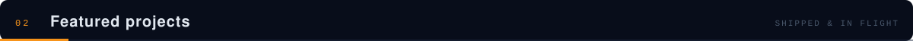

<!--
  Profile README for github.com/pauloes-btechs
  This repo must be named exactly `pauloes-btechs` (same as the username) and be public
  for GitHub to show it on the profile overview page.
  Assets are generated by gen_assets.py — edit that, re-run, commit.
-->

<div align="center">

<a href="https://btechs.io"></a>

<br/>

<!-- ── link tabs ─────────────────────────────────────────────────────────── -->
<a href="https://btechs.io"></a>&nbsp;
<a href="https://btechs.io/about"></a>&nbsp;
<a href="https://pauloes.com"></a>&nbsp;
<a href="https://linkedin.com/in/pauloes"></a>&nbsp;
<a href="mailto:pauloes@btechs.io"></a>&nbsp;
<a href="https://github.com/Btechs-org"></a>

</div>

<br/>

<!-- ── 01 about ──────────────────────────────────────────────────────────── -->


<table>
<tr>
<td width="60%" valign="top">

Technologist and product leader building **secure digital infrastructure at the intersection of Bitcoin, finance, and open source**. 11+ years shipping enterprise-scale platform products (Bloomberg, City University of Seattle), now founding mission-driven Bitcoin ventures backed by Jack Dorsey's **#startsmall** and MIT's **Digital Currency Initiative**.

I care about the whole stack: the roadmap *and* the cloud project, the IAM policy *and* the landing page. If it needs to be resilient, private, and actually shipped, that's where I like to work.

</td>
<td width="40%" valign="top">

```yaml
name:      Pauloes Berhe
base:      New York, NY
roles:     [Founder & Technical Lead @ Btechs,
            Member, MIT DCI Global]
focus:     [bitcoin infrastructure, secure cloud,
            product strategy, digital public goods]
values:    [resilience, security, privacy,
            accessibility, stewardship]
open_to:   senior / lead product roles
```

</td>
</tr>
</table>

<!-- ── 02 featured projects ──────────────────────────────────────────────── -->


<table>
<tr>
<td width="50%"><a href="https://btechs.io"></a></td>
<td width="50%"><a href="https://dci-global-research-map.vercel.app"></a></td>
</tr>
<tr>
<td width="50%"><a href="https://pauloes.com"></a></td>
<td width="50%"><a href="https://www.7eventhfoundation.org"></a></td>
</tr>
<tr>
<td width="50%"><a href="https://robotswillcry.com"></a></td>
<td width="50%"><a href="mailto:pauloes@btechs.io?subject=AEGIS"></a></td>
</tr>
</table>

<!-- ── 03 portfolio ──────────────────────────────────────────────────────── -->


<a href="https://pauloes.com"></a>

<details>
<summary><b>Read the longer version</b> — programs, outcomes, and numbers</summary>
<br/>

| Where | Role | What happened |
|---|---|---|
| **Btechs** · 2025 → now | Founder & Technical Lead | Bitcoin + AI workshops, secure cloud and security engineering; lead the MIT DCI **Global Research Map** platform and AI/ML education work on Google Cloud. |
| **Bitcoin Innovation Hub** · 2024 → 2026 | Co-Founder & CEO | Built a Bitcoinized settlement product on **BTCPayServer** that cut transaction fees **90%+** for small businesses. Backed by a **$300K #startsmall** grant. |
| **Bloomberg LP** · 2022 → 2024 | Sr. Technical Product Manager | Owned **20+ digital properties** with **1M+ monthly users**; shipped **200+ features** across the marketing stack (SFMC, Webflow, Asana, SalesWings). |
| **City University of Seattle** · 2014 → 2022 | Technical Product Manager | Led the **Azure migration** and a **$2.8M** infrastructure program; vendor programs with Sabey, Cisco and Juniper. |

Full story, charts and role pages → **[pauloes.com](https://pauloes.com)**

</details>

<!-- ── 04 stack ──────────────────────────────────────────────────────────── -->


<div align="center">

**Product & delivery**<br/>


**Bitcoin & finance**<br/>


**Cloud & security**<br/>


**Web**<br/>


**AI tooling**<br/>


</div>

<!-- ── 05 stats ──────────────────────────────────────────────────────────── -->
<!-- Live tracker: every card below is regenerated by .github/workflows/tracker.yml
     (every 6h + on every push) and published to the `output` branch. -->


<table>
<tr>
<td width="50%"><a href="https://github.com/pauloes-btechs?tab=repositories"></a></td>
<td width="50%"><a href="https://github.com/pauloes-btechs?tab=repositories"></a></td>
</tr>
</table>

<a href="https://github.com/pauloes-btechs"></a>

<a href="https://github.com/pauloes-btechs?tab=repositories"></a>

<div align="center">

<a href="https://github.com/pauloes-btechs"></a>


</div>

<br/>

<div align="center">

<a href="https://btechs.io"></a>

<sub>Palette and motif borrowed from <a href="https://btechs.io">btechs.io</a> · assets are hand-built SVGs, no trackers · <a href="https://github.com/pauloes-btechs/pauloes-btechs">source</a></sub>

</div>
